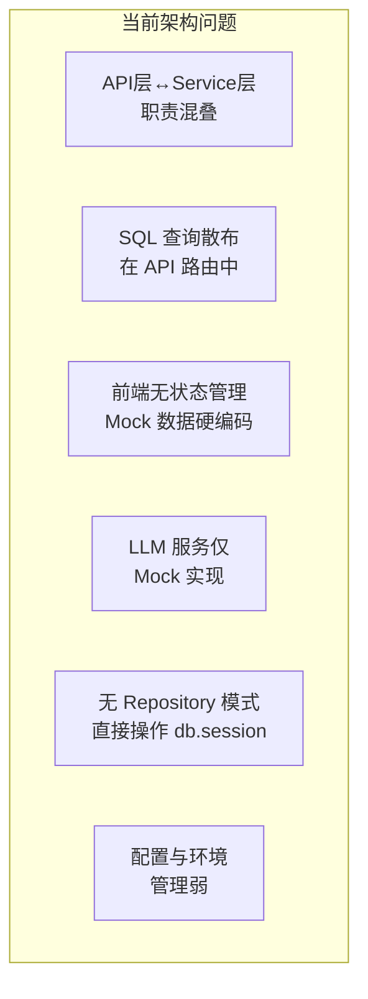
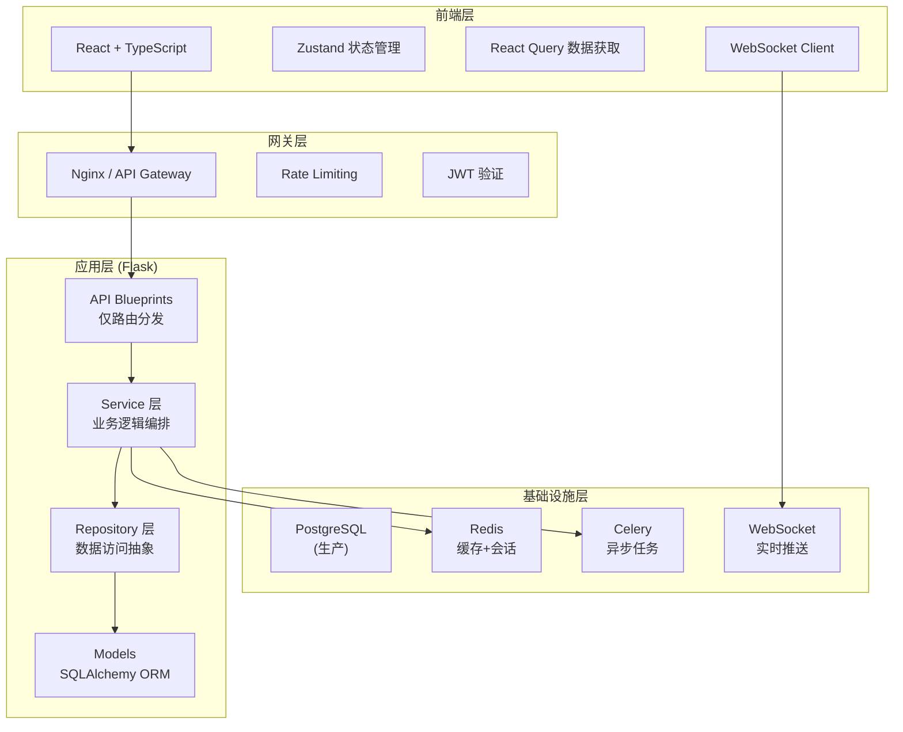
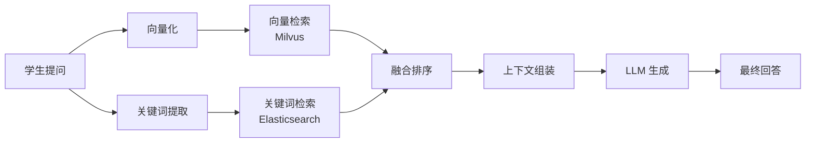

# EduMentor V2 — 架构优化与功能增强设计方案

> **文档类型**: 架构设计文档 (ADD) + 架构决策记录 (ADR)
> **版本**: v2.0.0
> **状态**: 审核中
> **日期**: 2026-06-18

---

## 1. 当前架构全景分析

### 1.1 现状评估

| 维度 | 评分 | 关键问题 |
|------|------|---------|
| 代码组织 | ⚠️ 6/10 | API 层与业务逻辑耦合，Utils 层职责过杂 |
| 可扩展性 | ⚠️ 5/10 | 单体 Flask 应用，无模块化拆分 |
| 可测试性 | 🔴 3/10 | 无测试框架，无依赖注入 |
| 类型安全 | 🔴 2/10 | Python 无类型约束，前端 JS 无 TypeScript |
| 错误处理 | ⚠️ 5/10 | 部分 try-catch 静默吞异常 |
| 状态管理 | 🔴 3/10 | 前端纯 useState，无全局状态 |
| 数据层 | ⚠️ 5/10 | SQLite 仅适合开发，无连接池优化 |
| 实时能力 | 🔴 1/10 | 无 WebSocket，轮询模式 |
| 安全性 | ⚠️ 5/10 | 基础认证存在，无 RBAC/CSRF/限流 |
| 可观测性 | 🔴 2/10 | 仅有文件日志，无 Metrics/Tracing |

### 1.2 架构技术债务清单



---

## 2. V2 架构目标

### 2.1 核心原则

1. **分层清晰**：API → Service → Repository → Model 四层严格分离
2. **可测试**：依赖注入 + 接口抽象，Mock 友好
3. **类型安全**：Python type hints + Pydantic + TypeScript
4. **可观测**：结构化日志 + Prometheus Metrics + OpenTelemetry Tracing
5. **实时性**：WebSocket 推送学情变化
6. **安全性**：RBAC + JWT + Rate Limit + CSRF

### 2.2 目标架构



---

## 3. 架构决策记录 (ADR)

### ADR-001: 后端采用分层架构 + Repository 模式

**状态**: 已接受  
**背景**: 当前 API 蓝图直接包含 SQL 查询和业务逻辑，难以测试和维护。  
**决策**: 
- API 层：仅做请求解析、参数校验、响应格式化
- Service 层：编排业务逻辑，调用 Repository
- Repository 层：封装所有数据库操作，返回 Model 或 DTO
- 使用 `abc.ABC` 定义 Repository 接口
  
**后果**: 
- ✅ 可单元测试（Mock Repository）
- ✅ 更换 ORM 或数据库不影响业务层
- ⚠️ 增加少量模板代码

### ADR-002: 前端迁移 TypeScript + Zustand + React Query

**状态**: 已接受  
**背景**: 纯 JS 无类型约束，useState 散落各处，API 调用无缓存/重试。  
**决策**:
- TypeScript 严格模式
- Zustand 管理全局状态（用户、主题、学情）
- React Query (TanStack Query) 管理服务端数据缓存
- 自定义 Hook 封装业务逻辑

**后果**:
- ✅ 编译期类型检查
- ✅ API 自动缓存、重试、过期刷新
- ⚠️ 迁移成本（但可渐进式进行）

### ADR-003: WebSocket 替代轮询实现实时推送

**状态**: 已接受  
**背景**: 驾驶舱和预警需要实时更新，当前无推送机制。  
**决策**:
- 后端: Flask-SocketIO
- 前端: Socket.IO Client
- 推送场景: 预警触发、学情更新、教师通知
  
**后果**:
- ✅ 实时性从分钟级提升到秒级
- ⚠️ 需要管理连接状态

### ADR-004: PostgreSQL 替代 SQLite（生产环境）

**状态**: 待实施  
**背景**: SQLite 不支持并发写、无连接池、不适合生产。  
**决策**:
- 开发环境: SQLite（保持零配置）
- 生产环境: PostgreSQL + PgBouncer 连接池
- 使用 Flask-Migrate 管理 Schema 变更

**后果**:
- ✅ 生产级并发能力
- ✅ 支持 JSON 字段、全文检索
- ⚠️ 增加运维复杂度

### ADR-005: Pydantic 替代原生 dict 做 DTO/校验

**状态**: 已接受  
**背景**: 当前 API 参数校验靠手写 if-else，返回数据用 dict。  
**决策**:
- 请求体用 Pydantic model 做自动校验
- 响应用 Pydantic model 保证结构一致性
- 错误时自动返回 422 + 校验详情

**后果**:
- ✅ 零样板代码的参数校验
- ✅ OpenAPI 文档自动生成
- ⚠️ 增加依赖 (pydantic)

---

## 4. 详细模块重构方案

### 4.1 后端目录结构 (V2)

```
backend/
├── app/
│   ├── __init__.py                 # 应用工厂
│   ├── extensions.py               # Flask 扩展初始化
│   ├── config.py                   # 配置（多环境）
│   │
│   ├── api/                        # API 蓝图（仅路由）
│   │   ├── __init__.py
│   │   ├── auth.py
│   │   ├── diagnosis.py
│   │   ├── path_planning.py
│   │   ├── qa_tutoring.py
│   │   ├── error_review.py
│   │   ├── alert.py
│   │   ├── dashboard.py
│   │   └── websocket.py            # WebSocket 事件处理
│   │
│   ├── services/                   # 业务逻辑层
│   │   ├── __init__.py
│   │   ├── diagnosis_service.py
│   │   ├── path_service.py
│   │   ├── tutoring_service.py
│   │   ├── review_service.py
│   │   ├── alert_service.py
│   │   ├── dashboard_service.py
│   │   ├── llm_gateway.py          # LLM 网关（多模型支持）
│   │   └── notification_service.py # 推送通知服务
│   │
│   ├── repositories/               # 数据访问层
│   │   ├── __init__.py
│   │   ├── base.py                 # 通用 CRUD Repository
│   │   ├── user_repo.py
│   │   ├── knowledge_repo.py
│   │   ├── answer_repo.py
│   │   ├── error_repo.py
│   │   ├── alert_repo.py
│   │   └── study_repo.py
│   │
│   ├── models/                     # 数据模型
│   │   ├── __init__.py
│   │   └── ... (现有12个模型)
│   │
│   ├── schemas/                    # Pydantic DTO (+ 响应模型)
│   │   ├── __init__.py
│   │   ├── diagnosis.py
│   │   ├── path.py
│   │   ├── qa.py
│   │   ├── review.py
│   │   ├── alert.py
│   │   └── common.py
│   │
│   ├── utils/                      # 工具函数
│   │   ├── __init__.py
│   │   ├── responses.py            # 统一响应格式
│   │   ├── errors.py               # 自定义异常类
│   │   ├── helpers.py
│   │   └── auth.py
│   │
│   └── tasks/                      # Celery 异步任务
│       ├── __init__.py
│       ├── alert_tasks.py
│       ├── review_tasks.py
│       └── report_tasks.py
│
├── tests/                          # 测试套件
│   ├── __init__.py
│   ├── conftest.py
│   ├── test_services/
│   ├── test_apis/
│   └── test_repositories/
│
├── migrations/                     # 数据库迁移
├── requirements.txt
├── requirements-dev.txt
├── Dockerfile
├── docker-compose.yml
└── run.py
```

### 4.2 前端目录结构 (V2)

```
frontend/
├── src/
│   ├── main.tsx
│   ├── App.tsx
│   │
│   ├── api/                        # API 层
│   │   ├── client.ts              # Axios 实例 + 拦截器
│   │   ├── diagnosis.ts
│   │   ├── path.ts
│   │   ├── qa.ts
│   │   ├── review.ts
│   │   └── dashboard.ts
│   │
│   ├── stores/                     # Zustand 状态
│   │   ├── authStore.ts
│   │   ├── diagnosisStore.ts
│   │   └── uiStore.ts
│   │
│   ├── hooks/                      # 自定义 Hooks
│   │   ├── useDiagnosis.ts
│   │   ├── useLearningPath.ts
│   │   ├── useQA.ts
│   │   └── useWebSocket.ts
│   │
│   ├── pages/                      # 页面组件
│   │   ├── student/
│   │   │   ├── Dashboard.tsx
│   │   │   ├── LearningPath.tsx
│   │   │   ├── QATutoring.tsx
│   │   │   └── ErrorReview.tsx
│   │   └── teacher/
│   │       └── Dashboard.tsx
│   │
│   ├── components/                 # 可复用组件
│   │   ├── common/
│   │   │   ├── MainLayout.tsx
│   │   │   ├── RadarChart.tsx
│   │   │   ├── LoadingSpinner.tsx
│   │   │   └── ErrorBoundary.tsx
│   │   ├── student/
│   │   │   ├── KnowledgeHeatmap.tsx
│   │   │   ├── WeakPointList.tsx
│   │   │   └── StudyTimer.tsx
│   │   └── teacher/
│   │       ├── StudentTable.tsx
│   │       └── AlertPieChart.tsx
│   │
│   ├── types/                      # TypeScript 类型
│   │   ├── api.ts
│   │   ├── diagnosis.ts
│   │   ├── path.ts
│   │   └── user.ts
│   │
│   └── utils/
│       ├── constants.ts
│       └── helpers.ts
│
├── vite.config.ts
├── tsconfig.json
├── package.json
└── index.html
```

---

## 5. 核心功能增强

### 5.1 BKT 知识追踪引擎增强

当前实现仅为简单正确率统计，V2 引入真实 BKT 算法：

```python
class BKTEngine:
    """
    贝叶斯知识追踪
    参数:
        p_learn: 学习概率 P(T)
        p_guess: 猜测概率 P(G)
        p_slip: 失误概率 P(S)
        p_init: 初始掌握概率 P(L₀)
    """
    def update_belief(self, kp_id, is_correct):
        # 1. 根据观测更新后验
        # 2. 预测下一步表现
        # 3. 返回掌握概率
```

### 5.2 RAG 检索增强生成

当前 LLM 服务仅有 Mock 回复，V2 实现完整 RAG pipeline：



### 5.3 WebSocket 实时推送

| 事件名 | 方向 | 说明 |
|--------|------|------|
| `alert:new` | Server → Client | 新预警触发 |
| `mastery:update` | Server → Client | 掌握度更新 |
| `progress:sync` | 双向 | 学习进度同步 |
| `notification:push` | Server → Client | 系统通知 |

### 5.4 三级预警强化

- **蓝色预警**: 自动推送学习资源 + 调整路径
- **黄色预警**: 触发教师通知 + 路径难度调整
- **红色预警**: 强制学习计划调整 + 教务备案

---

## 6. 实施路线图

### Phase 1: 架构重构 (Week 1-2)
- [x] 后端 Repository 模式抽取
- [x] Pydantic Schema 定义
- [x] 统一异常处理框架
- [x] 单元测试框架搭建

### Phase 2: 前端升级 (Week 3-4)
- [ ] TypeScript 迁移
- [ ] Zustand Store 定义
- [ ] React Query 集成
- [ ] 组件拆分与 Storybook

### Phase 3: 功能增强 (Week 5-6)
- [ ] BKT 真实算法实现
- [ ] RAG 检索 pipeline
- [ ] WebSocket 实时推送
- [ ] LLM 多模型网关

### Phase 4: 基础设施 (Week 7-8)
- [ ] Docker Compose 部署
- [ ] PostgreSQL 迁移脚本
- [ ] CI/CD Pipeline
- [ ] 监控告警体系

---

## 7. 风险与缓解

| 风险 | 概率 | 影响 | 缓解措施 |
|------|------|------|---------|
| LLM API 成本超支 | 中 | 高 | 实施缓存 + 请求合并 + 降级策略 |
| WebSocket 连接管理复杂 | 中 | 中 | 使用 SocketIO 成熟方案 |
| TypeScript 迁移工期长 | 高 | 中 | 渐进式迁移，新文件用 TS |
| BKT 超参调优复杂 | 中 | 中 | 先用 EM 算法离线训练 |
| 数据库迁移数据丢失 | 低 | 高 | 完整备份 + 回滚脚本 |

---

## 8. 评审检查项

- [x] 安全性：RBAC + JWT + Rate Limit 已规划
- [x] 性能：Redis 缓存 + 数据库连接池 + N+1 查询优化
- [x] 可维护性：分层清晰，职责单一
- [x] 可测试性：依赖注入 + Repository Mock
- [x] 可部署性：Docker Compose + 环境配置分离
- [x] 可观测性：结构化日志 + Metrics + Tracing
